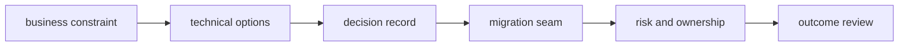

# Staff Engineer Trade-offs

## 30-Second Answer

Staff Engineer Trade-offs is the path from **business constraint** to **outcome review**. The essential handoffs are technical options, decision record, migration seam, risk and ownership. In production, I verify each handoff independently, keep its identity and state boundary visible, and operate it against availability, latency, security, and recovery objectives.

## Mental Model

Read this diagram as a concrete sequence, not a generic maturity loop: a failure after **risk and ownership** has different evidence and ownership from a failure at **technical options**.

## Why It Exists

Without staff engineer trade-offs, teams must manually coordinate business constraint, migration seam, and outcome review. The technology standardizes those interfaces so changes are repeatable, reviewable, and diagnosable. It is justified when the repeated operational risk exceeds the cost of owning the abstraction.

## How It Works

**business constraint** owns stage 1; **technical options** owns stage 2; **decision record** owns stage 3; **migration seam** owns stage 4; **risk and ownership** owns stage 5; **outcome review** owns stage 6. Follow resource IDs, revisions, events, and timestamps across these stages; an acknowledgement at one stage never proves completion at the next.

## Mechanisms

* **business constraint:** Inspect its native state, events, latency, permissions, and capacity before moving to the next component.
* **technical options:** Inspect its native state, events, latency, permissions, and capacity before moving to the next component.
* **decision record:** Inspect its native state, events, latency, permissions, and capacity before moving to the next component.
* **migration seam:** Inspect its native state, events, latency, permissions, and capacity before moving to the next component.
* **risk and ownership:** Inspect its native state, events, latency, permissions, and capacity before moving to the next component.
* **outcome review:** Inspect its native state, events, latency, permissions, and capacity before moving to the next component.

## Production Architecture

Deploy business constraint with least privilege and an auditable change path. Isolate migration seam by environment and failure domain, make outcome review observable, and test loss of each dependency. Version the interface between stages so producers and consumers can roll independently.

## Failure Modes

| Failure | Evidence | Response |
|---|---|---|
| the abstraction hides a failure users must debug | Compare stage latency and revision at technical options | Stop promotion and restore the last verified input |
| a mandatory path lacks an escape hatch or migration | Inspect saturation, quotas, events, and pending work at migration seam | Add valid capacity or shed load; do not retry without a bound |
| adoption metrics count activity rather than developer outcomes | Compare the user result with outcome review and upstream state | Mitigate first, preserve evidence, then repair the faulty contract |

## Trade-offs

More automation across business constraint and outcome review improves consistency but can propagate an error faster. Strong isolation narrows blast radius but increases cost and upgrades. Managed implementations reduce component toil; self-managed implementations offer control but require availability, backup, security patching, and on-call expertise.

## Lead-Level Follow-ups

* Which team owns **migration seam**, and what user-facing SLO proves it works?
* What remains available when **technical options** is down?
* Where is state durable, and how are restore and upgrade tested?

## My Experience Prompt

Describe a change to migration seam: state the constraint, the exact signal that selected the design, the rollback boundary, and the durable guardrail you added.

## Recall Check

1. What does **business constraint** send to **technical options**?
2. Which component stores or reports authoritative state?
3. How does **risk and ownership** affect **outcome review**?
4. Which capacity limit fails first at production scale?
5. When is a simpler managed alternative preferable?

## Related Notes

* [Category index](index.md)
* [Interview dashboard](../00-interview-dashboard.md)
